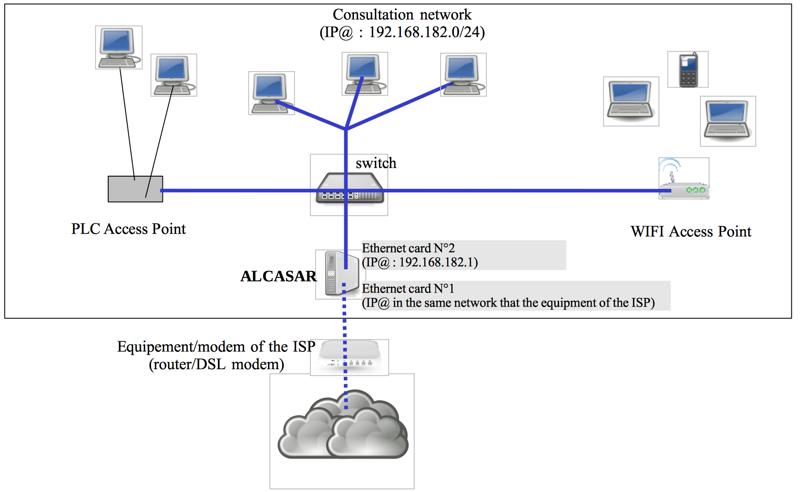

============
Installation
============

Introduction
============

This document describes the installation procedure of the ALCASAR portal. It is supplemented with three other documents : the presentation document, the operating instructions document and the technical document.
If you already have a working version of ALCASAR and you want to upgrade it, please refer to the operating instructions document (chapter « update »).
ALCASAR can be installed on a standard computer with two Ethernet network cards. The first one (eth0) is connected to the Internet Service Provider's equipment. The second one (eth1) is connected to the switch used to service the network consultation computers.
By default, the IP address of this second network card is : 192.168.182.1/24.
This allows to have a class C network (254 equipments). This network addressing plan can be modified during the installation stage.
For all equipment of consultation network, ALCASAR is the DHCP server, the DNS server,
the network time server and the default router (gateway).
**Thus, on this network, there must be no other DHCP server and gateway** (check your wifi access points).

**Example with default class C network (254 equipments)**

* IP address of ALCASAR : 192.168.182.1/24
* Maximum number of equipment on the consultation network : 253
* Network settings of equipment :

  * available IP addresses : from 192.168.182.2 to 192.168.182.254 (static or dynamic)
  * subnet mask : 255.255.255.0
  * IP address of the DNS server and of the default gateway : 192.168.182.1 (IP address of ALCASAR)
  * DNS suffix for equipment with static IP address : “localdomain”

**Example with a class B network (65534 equipments)**

* IP address of ALCASAR : 172.16.0.1/16
* Maximum number of equipment on the consultation network : 65533
* Network settings of equipment :

  * available IP addresses : from 172.16.0.2 to 172.16.255.254 (static or dynamic)
  * subnet mask : 255.255.0.0
  * IP address of the DNS server and of the default gateway : 172.16.0.1 (IP address of ALCASAR)
  * DNS suffix for equipment with static IP address : “localdomain”

Even if it is possible to define a class A network,
you shouldn't do it because the embedded DHCP server will have to manage over than 16 millions of IP addresses.
The management of such volume of addresses would spend too much memory.

Installation
============

The installation of the portal consists of two steps.
The first one is the installation of a minimalist Linux operating system based on Mageia 4.1.
The second step installs and configures all the components of ALCASAR.

Hardware requirement
--------------------

ALCASAR only requires one standard desktop computer with two network cards and
a hard drive with a capacity of at least 100 Go in order to be able to store logs related to connections tracing.
ALCASAR includes several optional filtering systems (network protocols, URL, IP addresses, domain names and antimalware).
If you decide to enable these filtering systems,
it is recommended to install at least 8GB of RAM in order to ensure an acceptable processing speed (ALCASAR loves the RAM  ;-)  )

.. note:: In case of using a Virtual Machine (VM) : be sure that the size of the hard drive **isn't less than 25G.**

 2.2. Installation of the system
--------------------------------

The installation procedure of the operating system is the following (estimated time : 6') :

* get the Mageia 4.1 ISO image file in double architectures (32 and 64 bits) : « mageia-4.1-dual-DVD.iso » (1 GB).
  This ISO image is available on ALCASAR website as well as on several `mirror sites of Mageia <http://mirrors.mageia.org/>`_.
  For example :

  * http://www.mirrorservice.org/sites/mageia.org/pub/mageia/iso/4.1/
  * http://distrib-coffee.ipsl.jussieu.fr/pub/linux/Mageia/iso/4.1/

* burn this ISO image file on a DVDROM or create a bootable USB flash drive1. You can also use a external USB disk
  which simulate a bootable device (ex : zalman zm-ve300 or 400).
* configure the BIOS settings to unset the “Secure Boot” option, to set the date and time and to enable booting from
  the CD or USB flash drive. At the end of the installation, configure, once again,
  the BIOS settings to only boot from the hard drive ;
* insert the CD-ROM or the USB flash drive, reboot the computer and follow the instructions bellow :

+-------------------------------------------------------+-----------------------------------------------------------------+-------------------------------------------+
|  Screen display                                       |      Comments                                                   |      Actions to achieve                   |
+=======================================================+=================================================================+===========================================+
|.. image:: images/mageia_installation_menu.png         || After starting the computer, this screen is displayed.         | Select “Install Mageia 4”.                |
|                                                       ||                                                                |                                           |
|                                                       ||  * If the graphical mode doesn't work, you have to configure   |                                           |
|                                                       ||  the BIOS settings to allocate more than 2MB of shared memory  |                                           |
|                                                       ||  for the graphics card.                                        |                                           |
+-------------------------------------------------------+-----------------------------------------------------------------+-------------------------------------------+
|.. image:: images/mageia_installation_choix_langue.png |                                                                 || Select your language.                    |
|                                                       |                                                                 ||                                          |
+-------------------------------------------------------+-----------------------------------------------------------------+-------------------------------------------+
|.. image:: images/mageia_installation_licence.png      || This license agreement explains that the installed software    || Accept the license agreement.            |
|                                                       || are free (GPL).                                                ||                                          |
|                                                       ||                                                                ||                                          |
+-------------------------------------------------------+-----------------------------------------------------------------+-------------------------------------------+
|.. image:: images/mageia_installation_clavier.png      ||                                                                || Choose your keyboard layout.             |
|                                                       ||                                                                ||                                          |
+-------------------------------------------------------+-----------------------------------------------------------------+-------------------------------------------+
|.. image:: images/mageia_installation_partition.png    || The hard disk partitioning will be adapted to the needs        || Select “Custom disk partitioning”.       |
|                                                       || of ALCASAR (see next step).                                    ||                                          |
|                                                       ||                                                                ||                                          |
+-------------------------------------------------------+-----------------------------------------------------------------+-------------------------------------------+
|.. image:: images/mageia_installation_partition_2.png  || After removing all the partitions, create the following        || Click on “Clear all”.                    |
|                                                       || 5 partitions :                                                 ||                                          |
|                                                       ||                                                                || Then click on the area of the disk (sda) |
|                                                       || - / : 4 GB                                                     || to create each new partition.            |
|                                                       || - swap : keep the default size                                 ||                                          |
|                                                       || - /tmp : 4 GB                                                  || Info: except the partition of swap, all  |
|                                                       || - /home : 4 GB                                                 || the filesystem (FS) type  are            |
|                                                       || - /var : the rest of the hard drive ( **size bigger than 10G** || “Journalized FS : ext4”.                 |
|                                                       ||   **even on a virtual machine**).                              ||                                          |
|                                                       ||                                                                ||                                          |
+-------------------------------------------------------+-----------------------------------------------------------------+-------------------------------------------+
|.. image:: images/mageia_installation_partition_3.jpg  | .. image:: images/mageia_installation_partition_4.jpg           || Create the root partition (/).           |
|                                                       ||                                                                || Choose its size (4 Go) and its           |
|                                                       || At the end of this operation, and depending on the size        || filesystem (ext4).                       |
|                                                       || of your hard drive, the partitioning should look like this :   ||                                          |
|                                                       |                                                                 || Recommencez cette étape pour             |
|                                                       |                                                                 || toutes les autres partitions.            |
|                                                       |                                                                 ||                                          |
|                                                       |                                                                 || Une fois le partitionnement              |
|                                                       |                                                                 || effectué, cliquez sur « Terminer ».      |
+-------------------------------------------------------+-----------------------------------------------------------------+-------------------------------------------+
|.. image:: images/mageia_installation_media.png        | For ALCASAR, it does not need any other media                   || Select “None” then click “Next”          |
|                                                       |                                                                 ||                                          |
+-------------------------------------------------------+-----------------------------------------------------------------+-------------------------------------------+
|.. image:: images/mageia_installation_media_2.png      |                                                                 || Leave the “Nonfree Release” media        |
|                                                       |                                                                 || enabled then click “Next”                |
|                                                       |                                                                 ||                                          |
+-------------------------------------------------------+-----------------------------------------------------------------+-------------------------------------------+
|.. image:: images/mageia_installation_paquetage.png    || Package group selection : ALCASAR only requires a              || Select “Unselect All" then click "Next". |
|                                                       || very minimal install.                                          ||                                          |
|                                                       ||                                                                || Info: On Linux, a package is an archive  |
|                                                       ||                                                                || file containing all the components of    |
|                                                       ||                                                                || a software (binary files, help files,    |
|                                                       ||                                                                || configuration files, etc.).              |
|                                                       ||                                                                ||                                          |
+-------------------------------------------------------+-----------------------------------------------------------------+-------------------------------------------+
|.. image:: images/mageia_installation_paquetage_2.png  ||                                                                || Select only “Install suggested packages”,|
|                                                       ||                                                                || then click “Next”.                       |
|                                                       ||                                                                || The copy of the packages is launched.    |
|                                                       ||                                                                || Estimated time : 2'                      |
|                                                       ||                                                                ||                                          |
+-------------------------------------------------------+-----------------------------------------------------------------+-------------------------------------------+
|.. image:: images/mageia_installation_utilisateurs.png ||                                                                || Assign a password to the "root" account, |
|                                                       ||                                                                || then, create the "sysadmin" account      |
|                                                       ||                                                                || and assign it a password.                |
|                                                       ||                                                                ||                                          |
+-------------------------------------------------------+-----------------------------------------------------------------+-------------------------------------------+
|.. image:: images/mageia_installation_config.png       || Configuration of Internet access                               || Click on "Configure" in                  |
|                                                       ||                                                                || "Network-ethernet" in the                |
|                                                       ||                                                                || "Network & Internet" section.            |
|                                                       ||                                                                ||                                          |
+-------------------------------------------------------+-----------------------------------------------------------------+-------------------------------------------+
|.. image:: images/mageia_installation_internet.png     ||                                                                || Select the type of Internet connection.  |
|                                                       ||                                                                || In the case of use of an ISP broadband   |
|                                                       ||                                                                || modem, choose "Wired (Ethernet)".        |
|                                                       ||                                                                ||                                          |
|                                                       ||                                                                || *Info*: no test has yet been made on     |
|                                                       ||                                                                || other types of Internet access.          |
|                                                       ||                                                                ||                                          |
+-------------------------------------------------------+-----------------------------------------------------------------+-------------------------------------------+
|.. image:: images/mageia_installation_internet_2.png   || For the moment, only the interface connected to the broadband  || Select the interface to configure.       |
|                                                       || modem of the ISP will be configured. The second interface,     ||                                          |
|                                                       || connected to the consultation network, will be configured      || *Tips*: Choose the interface with        |
|                                                       || later, during the installation of ALCASAR.                     || the smallest index. **Write the name of**|
|                                                       ||                                                                || **this interface on a paper.**           |
|                                                       ||                                                                ||                                          |
|                                                       ||                                                                || *Info* : the names of interfaces are     |
|                                                       ||                                                                || linked with the physical architecture of |
|                                                       ||                                                                || your PC. They could differ of the        |
|                                                       ||                                                                || printscreen.                             |
|                                                       ||                                                                ||                                          |
+-------------------------------------------------------+-----------------------------------------------------------------+-------------------------------------------+
|.. image:: images/mageia_installation_internet_3.png   ||                                                                || Select “Manual configuration”            |
|                                                       ||                                                                ||                                          |
|                                                       ||                                                                || *Info* : While it is possible to let this|
|                                                       ||                                                                || interface in “bootp/dhcp” mode, we       |
|                                                       ||                                                                || recommended to configure it manually     |
|                                                       ||                                                                || in static mode.                          |
|                                                       ||                                                                ||                                          |
+-------------------------------------------------------+-----------------------------------------------------------------+-------------------------------------------+
|.. image:: images/mageia_installation_internet_4.png   || Example :                                                      || Enter the parameters of this interface   |
|                                                       || - IP address : this address must be in the same subnet as      ||                                          |
|                                                       || the address of the broadband modem.                            || * Enter the IP addresses of the DNS      |
|                                                       || - Netmask : 255.255.255.0                                      || servers provided by your ISP. You can    |
|                                                       || - Gateway : This is the address of the broadband modem         || also use other DNS servers.              |
|                                                       || - DNS 1 and DNS 2 :*                                           || Examples: :                              |
|                                                       || - Host name : Leave this field blank                           || - Free project “OpenNic” (see the web    |
|                                                       ||                                                                ||   site to know the closest servers for   |
|                                                       ||                                                                ||   you)                                   |
|                                                       ||                                                                || - project “OpenDNS" (DNS1=208.67.222.222,|
|                                                       ||                                                                ||   DNS2=208.67.220.220)                   |
|                                                       ||                                                                || - google (DNS1=8.8.8.8, DNS2=8.8.4.4).   |
|                                                       ||                                                                ||                                          |
+-------------------------------------------------------+-----------------------------------------------------------------+-------------------------------------------+
|.. image:: images/mageia_installation_internet_5.png   ||                                                                || Select only                              |
|                                                       ||                                                                || "Start the connection at boot"           |
|                                                       ||                                                                ||                                          |
+-------------------------------------------------------+-----------------------------------------------------------------+-------------------------------------------+
|.. image:: images/mageia_installation_internet_6.png   || It is not necessary to start the connection now.               || Select "No"                              |
|                                                       ||                                                                ||                                          |
+-------------------------------------------------------+-----------------------------------------------------------------+-------------------------------------------+
|.. image:: images/mageia_installation_internet_7.png   ||                                                                || Click on "Finish"                        |
|                                                       ||                                                                ||                                          |
+-------------------------------------------------------+-----------------------------------------------------------------+-------------------------------------------+
|.. image:: images/mageia_installation_config_2.png     ||                                                                || Click on "Next"                          |
|                                                       ||                                                                ||                                          |
+-------------------------------------------------------+-----------------------------------------------------------------+-------------------------------------------+
|.. image:: images/mageia_installation_mise_a_jour.png  || Security updates will be managed during the installation       || Select "No" and click on "Next"          |
|                                                       || of ALCASAR.                                                    ||                                          |
|                                                       ||                                                                ||                                          |
+-------------------------------------------------------+-----------------------------------------------------------------+-------------------------------------------+
|.. image:: images/mageia_installation_felicitation.png || The installation is finished                                   || Click on "Reboot".                       |
|                                                       ||                                                                || Remove the CDROM or the USB flash drive  |
|                                                       ||                                                                || Reconfigure the BIOS to boot             |
|                                                       ||                                                                || only from the hard drive.                |
|                                                       ||                                                                ||                                          |
+-------------------------------------------------------+-----------------------------------------------------------------+-------------------------------------------+

Installation of ALCASAR
-----------------------

Configuration of the network cards
^^^^^^^^^^^^^^^^^^^^^^^^^^^^^^^^^^

+-------------------------------------------------------+-----------------------------------------------------------------+-------------------------------------------+
|  Screen display                                       |      Comments                                                   |      Actions to achieve                   |
+=======================================================+=================================================================+===========================================+
|.. image:: images/alcasar_installation_reseau.png      || Disconnect the cables of the two network cards.                |                                           |
|                                                       || Log in as root                                                 |                                           |
|                                                       ||                                                                |                                           |
+-------------------------------------------------------+-----------------------------------------------------------------+-------------------------------------------+
|                                                       || Run the blinking of the LED of the network card                || ``ethtool -p  enp0s3``                   |
|                                                       || configured previously                                          ||                                          |
|                                                       ||                                                                || On this blinking interface, connect the  |
|                                                       ||                                                                || cable linked to the ISP broadband modem  |
|                                                       ||                                                                || (Internet access).                       |
|                                                       ||                                                                ||                                          |
|                                                       ||                                                                || ``<Ctrl> + c``                           |
|                                                       ||                                                                ||                                          |
|                                                       ||                                                                || *Info* : replace “enp0s3” with the name  |
|                                                       ||                                                                || of the network card you've configured    |
|                                                       ||                                                                || previously (see Page 5). The commands    |
|                                                       ||                                                                || « ifconfig » or « ip link » display the  |
|                                                       ||                                                                || name of all the network card connected   |
|                                                       ||                                                                || in your PC.                              |
|                                                       ||                                                                ||                                          |
+-------------------------------------------------------+-----------------------------------------------------------------+-------------------------------------------+
|.. image:: images/alcasar_installation_reseau_2.png    || Verify that the link is up on this interface.                  || ``watch  ethtool  enp0s3``               |
|                                                       ||                                                                ||                                          |
|                                                       ||                                                                || *Info* : the last line display the link  |
|                                                       ||                                                                || state (Link detected <yes/no>)           |
|                                                       ||                                                                || (Link detected <yes/no>)                 |
|                                                       ||                                                                || Wait until the link is up. Otherwise,    |
|                                                       ||                                                                || plug the cable into the other network    |
|                                                       ||                                                                || card. When the link is detected, stop    |
|                                                       ||                                                                || the command with the ``<Ctrl> + c`` keys |
|                                                       ||                                                                ||                                          |
+-------------------------------------------------------+-----------------------------------------------------------------+-------------------------------------------+
|                                                       || Do the same operation with the second card (eth1) and the      || ``watch  ethtool  xxxxxxx``              |
|                                                       || cable connected to the consultation network.                   ||                                          |
|                                                       ||                                                                || *Info*: On the consultation network's    |
|                                                       ||                                                                || side, connect a network equipment        |
|                                                       ||                                                                || (Ethernet or PLC switch, WIFI AP, etc) to|
|                                                       ||                                                                || ensure a permanent network link even     |
|                                                       ||                                                                || if all consultation stations are off.    |
|                                                       ||                                                                ||                                          |
+-------------------------------------------------------+-----------------------------------------------------------------+-------------------------------------------+
|.. image:: images/alcasar_installation_test_reseau.png || Test your Internet connectivity                                || ``ping  -c3 www.google.fr``              |
|                                                       ||                                                                ||                                          |
+-------------------------------------------------------+-----------------------------------------------------------------+-------------------------------------------+

Download the installation file
^^^^^^^^^^^^^^^^^^^^^^^^^^^^^^

This file is an archive file named : alcasar-x.y.tar.gz ('x.y' means the version number you want).
You can download it in two different ways (USB flash drive or FTP) :

via an USB flash drive
""""""""""""""""""""""

Download the latest version on the ALCASAR website and copy it on an USB flash drive.

Then, use the following procedure to copy it on ALCASAR computer :

+-------------------------------------------------------+-----------------------------------------------------------------+-------------------------------------------+
|  Screen display                                       |      Comments                                                   |      Actions to achieve                   |
+=======================================================+=================================================================+===========================================+
|.. image:: images/alcasar_installation_usb.png         || Insert the USB flash drive.                                    ||                                          |
|                                                       ||                                                                || ``fdisk  -l``                            |
|                                                       || Display informations on mass media storage to get the name of  ||                                          |
|                                                       || your USB flash drive. In this example, "/dev/sdb1" is a 1GB    || *Info*: You also can display the system  |
|                                                       || USB flash drive.                                               || log to get this name                     |
|                                                       ||                                                                || (``journalctrl  -f)``)                   |
|                                                       ||                                                                ||                                          |
+-------------------------------------------------------+-----------------------------------------------------------------+-------------------------------------------+
|.. image:: images/alcasar_installation_usb_2.png       |                                                                 | .. code-block:: bash                      |
|                                                       |                                                                 |                                           |
|                                                       | #. Create a directory and mount the USB flash drive on it.      |   mkdir -p /media/usb                     |
|                                                       | #. Copy the archive of ALCASAR to the directory “/root”.        |   mount /dev/sdb1 /media/usb/             |
|                                                       | #. Unmount the USB flash drive.                                 |   cp /media/usb/alcasar-* /root/          |
|                                                       | #. Unplug it.                                                   |   umount /media/usb                       |
|                                                       |                                                                 |                                           |
|                                                       |                                                                 || *info* : Replace "sdb1" with the device  |
|                                                       |                                                                 || name retrieved in the previous step.     |
|                                                       |                                                                 ||                                          |
+-------------------------------------------------------+-----------------------------------------------------------------+-------------------------------------------+

via FTP
"""""""

Directly from the ALCASAR computer, download the archive file from the FTP server :

+-------------------------------------------------------+-----------------------------------------------------------------+-------------------------------------------+
|  Screen display                                       |      Comments                                                   |      Actions to achieve                   |
+=======================================================+=================================================================+===========================================+
|.. image:: images/alcasar_installation_ftp.jpg         | #. Connect to the FTP server with the “lftp” command            | .. code-block:: bash                      |
|                                                       | #. change to the directory “stable” and list its content        |                                           |
|                                                       | #. download the archive file                                    |   lftp ftp.alcasar.net/pub                |
|                                                       | #. quit                                                         |   cd stable                               |
|                                                       |                                                                 |   ls                                      |
|                                                       |                                                                 |   get alcasar-x.y.tar.gz                  |
|                                                       |                                                                 |   bye                                     |
|                                                       |                                                                 |                                           |
+-------------------------------------------------------+-----------------------------------------------------------------+-------------------------------------------+

Installation
^^^^^^^^^^^^

+-------------------------------------------------------+-----------------------------------------------------------------+-------------------------------------------+
|  Screen display                                       |     Comments                                                    |      Actions to achieve                   |
+=======================================================+=================================================================+===========================================+
|.. image:: images/alcasar_installation_archive.png     || Compute the SHA256 digital footprint of this archive and       ||                                          |
||                                                      || compare it with that of the website.                           || ``sha256sum  alcasar-x.y.tar.gz``        |
|.. image:: images/alcasar_installation_archive_2.png   ||                                                                ||                                          |
|                                                       ||                                                                || *Info*: If the digital footprint doesn't |
|                                                       ||                                                                || match, download the archive again.       |
|                                                       ||                                                                || If the problem occurs one more time,     |
|                                                       ||                                                                || ask the developer team via the forum.    |
|                                                       ||                                                                ||                                          |
+-------------------------------------------------------+-----------------------------------------------------------------+-------------------------------------------+
|.. image:: images/alcasar_installation_archive_3.png   | #. Uncompress and extract this archive.                         | .. code-block:: bash                      |
||                                                      | #. Move to the directory of ALCASAR .                           |                                           |
|.. image:: images/alcasar_installation_archive_4.png   | #. Run the installation script.                                 |   tar  -xvf  alcasar-x.y.tar.gz           |
|                                                       |                                                                 |   cd  alcasar-x.y                         |
|                                                       |                                                                 |   sh alcasar.sh  -i                       |
|                                                       |                                                                 ||                                          |
+-------------------------------------------------------+-----------------------------------------------------------------+-------------------------------------------+
|.. image:: images/alcasar_installation_license.png     || Acceptation of the license                                     || ALCASAR is a free software (open source) |
|                                                       ||                                                                || developed under the GPLV3 license.       |
|                                                       ||                                                                ||                                          |
+-------------------------------------------------------+-----------------------------------------------------------------+-------------------------------------------+
|.. image:: images/alcasar_installation_t_internet.png  || The network configuration is tested.                           ||                                          |
|                                                       ||                                                                ||                                          |
+-------------------------------------------------------+-----------------------------------------------------------------+-------------------------------------------+
|.. image:: images/alcasar_installation_paquetage.png   || The installation of about a hundred of software (packages)     ||                                          |
|                                                       || is done from Internet. Estimated time : 3'                     ||                                          |
|                                                       ||                                                                ||                                          |
+-------------------------------------------------------+-----------------------------------------------------------------+-------------------------------------------+
|.. image:: images/alcasar_installation_organisme.png   || Enter the name of your organization (without spaces)           || Example : rasacla                        |
|                                                       ||                                                                ||                                          |
|                                                       ||                                                                || *Info*: This name is mandatory. The only |
|                                                       ||                                                                || characters allowed are :                 |
|                                                       ||                                                                || [a-z] [A-Z] [0-9] [-]                    |
|                                                       ||                                                                ||                                          |
+-------------------------------------------------------+-----------------------------------------------------------------+-------------------------------------------+
|.. image:: images/alcasar_installation_ip.png          || Define the IP address of ALCASAR and the network addressing    || Enter « Y » or « N »                     |
|                                                       || plan of the consultation network. You can accept the default   ||                                          |
|                                                       || one or change it.                                              || *Info*: If you type "N", the script will |
|                                                       ||                                                                || ask you for the IP address of ALCASAR    |
|                                                       ||                                                                || and the subnet mask in CIDR notation     |
|                                                       ||                                                                || (ex: 172.16.0.1/16).                     |
|                                                       ||                                                                ||                                          |
+-------------------------------------------------------+-----------------------------------------------------------------+-------------------------------------------+
|.. image:: images/alcasar_installation_compte.png      || Enter the username and password for a first ALCASAR            || *Info* : This Linux account is used to   |
|                                                       || administrative account.                                        || administer ALCASAR from the consultation |
|                                                       ||                                                                || network via the graphical control center |
|                                                       ||                                                                || (http://alcasar). This is not a          |
|                                                       ||                                                                || consultation user account.               |
|                                                       ||                                                                ||                                          |
+-------------------------------------------------------+-----------------------------------------------------------------+-------------------------------------------+
|.. image:: images/alcasar_installation_fin.png         || The installation is complete.                                  || Once the system is restarted, connect  an|
|                                                       || The system will be restarted to synchronize all                || equipment on the consultation network    |
|                                                       || components of ALCASAR.                                         || and use it for log in on the portal      |
|                                                       ||                                                                || (http://alcasar). Create the first users.|
|                                                       ||                                                                || Read the exploitation guide  carefully   |
|                                                       ||                                                                ||                                          |
+-------------------------------------------------------+-----------------------------------------------------------------+-------------------------------------------+
|.. image:: images/alcasar_installation_verif.jpg       || Once the system is restarted, you can check that all needed    || If one or more services are not started, |
|                                                       || services are really started. Login on the system and run the   || the script will attempts to start them.  |
|                                                       || command “alcasar-daemon.sh”.                                   ||                                          |
|                                                       ||                                                                ||                                          |
+-------------------------------------------------------+-----------------------------------------------------------------+-------------------------------------------+

Stop, uninstall, re-install or update ALCASAR
---------------------------------------------

You can stop the ALCASAR computer with the power button, or with the command ``poweroff``, or via the WEB ALCASAR Control Center (ACC).
You can uninstall the portal with the command ``sh alcasar.sh --uninstall``. This command uninstalls only ALCASAR. The operating system (Linux Mageia) is still present.
If you launch the installation again or if you launch the installation of a newer version on a running version of ALCASAR, the script will ask you if you want to perform an update.

Preparation of an off-line installation
---------------------------------------

This procedure allow you to install ALCASAR in offline mode.
This can be useful when you manage to install ALCASAR in a place with a lack of Internet bandwidth.
In this case, it's interesting to create an archive file of all the packages (RPMS) needed.
This file will be used instead of the Internet downloading.

Use the following procedure :

- *Creation of the RPM archive file* : on a new PC, install “Mageia Linux” as describe in §2.2.
  Then, retrieve and uncompress the last ALCASAR archive. Go to the scripts directory ``cd alcasar-x.y/scripts/sbin`` et and run the script ``./alcasar-rpm-download.sh``.
  This script will create the RPM archive file of your PC architecture (32 or 64 bits). Retrieve this archive file on a USB key.
- *Offline installation :* after installing the system, retrieve the RPM archive file.
  Uncompress it and go in its directory. Install all the RPM (``urpmi –no-verify-rpm *``). Then, follow the installation process describe in chapter §2.3.
